<!-- _class: lead invert -->

# Lecanemab Effects on Aβ Plaques
## A Whole-Brain Light-Sheet Microscopy Analysis

**Spatial distribution · Treatment efficacy · Vascular relationships**

*March 2026*

---

## Outline

1. **Background** — Alzheimer's disease, Lecanemab & ApoE
2. **Dataset** — Cohort, imaging modality, data structure
3. **Analysis Pipeline** — Overview of 5-notebook workflow
4. **Methods** — Regional, treatment & vascular analyses
5. **Results** — Two cohorts: *Early* (3–6 mo) and *Late* (12–15 mo) treatment

---

<!-- _class: section-break lead -->

# Background

---

<!-- _class: light -->

## Alzheimer's Disease & Aβ Plaques

<div class="columns">
<div>

**Amyloid-β (Aβ) plaques** are a hallmark pathological feature of Alzheimer's disease, accumulating in the brain parenchyma and around cerebral vasculature.

**Key questions:**
- Which brain regions accumulate the most plaques?
- Does **Lecanemab** (anti-Aβ immunotherapy) reduce plaque burden?
- Does **ApoE genotype** (ApoE3 vs ApoE4) modulate treatment response?
- What is the spatial relationship between plaques and **blood vessels**?

</div>
<div>

**Experimental model:**
- Humanized mouse model of Alzheimer's disease
- hAppNL-F-hMAPT-APOE4 and hAppNL-F-hMAPT-APOE3

**Treatment arms:**
| Group | Description |
|---|---|
| PBS | Vehicle control |
| Lecanemab | Anti-Aβ immunotherapy |

**Readout:** Instance-level Aβ plaque segmentation via whole-brain 3-D light-sheet microscopy

</div>
</div>

---

<!-- _class: light -->

## Why Light-Sheet Microscopy?

<div class="columns">
<div>

**Whole-brain 3-D imaging** at near-cellular resolution enables:

- **Unbiased** spatial mapping of every Aβ plaque
- **Registration** to a common template (CCFv3 / ABAv3)
- Quantification of **vessel proximity** via CD31 vascular segmentation

**Voxel resolution:** 1.6 × 1.6 × 2.75 µm

</div>
<div>

**Signed Distance Transform (SDT):**

A plaque's `sdt_CD31` value encodes its distance to the nearest vessel wall:

| SDT value | Location |
|---|---|
| `< 0` | **Inside** vessel lumen |
| `0 – 5 µm` | **Near** vessel surface |
| `> 5 µm` | **Far** from vasculature |

> Vessel calibre estimated as:  
> `diam_vessel ≈ diam_plaque + 2|SDT|`

</div>
</div>

---

<!-- _class: section-break lead -->

# Dataset

---

<!-- _class: light -->

## Two Cohorts: Early vs Late Treatment

<div class="columns">
<div>

**Early cohort** (`data_early.parquet`)
- Lecanemab injections at **3–6 months**
- Light-sheet imaging at **12 months**

**Late cohort** (`data_late.parquet`)
- Lecanemab injections at **12–15 months**
- Light-sheet imaging at **15 months**

> Each cohort is analysed independently; figures are saved as  
> `fig_early_*.png` and `fig_late_*.png`

</div>
<div>

**Per-cohort plaque metrics:**
- `nvoxels` — voxel count (min: 200)
- `plaque_vol_ml` — volume (µL)
- `equiv_diam_um` — equivalent spherical diameter

**Spatial coordinates:**
- `pos_x / y / z` — raw image space
- `template_x / y / z` — CCFv3 template space

**Demographics:**
- `subject` — individual animal ID
- `genotype` — ApoE3 / ApoE4
- `sex` — M / F
- `treatment` — PBS / Lecanemab

</div>
</div>

---

<!-- _class: section-break lead -->

# Analysis Pipeline

---

<!-- _class: light -->

## Five-Notebook Workflow

```
import_data.ipynb
   │  Load raw data · Derive metrics
   │  → data_early.parquet  +  data_late.parquet
   ▼
regional_dataframe.ipynb
   │  Classify plaque–vessel proximity (per dataset)
   │  Aggregate to per-subject × per-region ROI summaries
   │  → roi_data_early.parquet  +  roi_data_late.parquet
   ├──▶ regional_analysis.ipynb
   │       Atlas heatmaps · ROI rankings · Fold-change maps
   │       → fig_{early|late}_atlas_*.png  etc.
   ├──▶ treatment_effect_analysis.ipynb
   │       Two-way ANOVA · Post-hoc comparisons · ECDFs
   │       → fig_{early|late}_boxplots_*.png  etc.
   └──▶ vessel_spatial_analysis.ipynb
           SDT distributions · Proximity fractions · Vessel calibre
           → fig_{early|late}_sdt_ecdf.png  etc.
```

> **Reproducibility:** All notebooks executed via `pixi run run_notebooks`  
> using the pinned Pixi environment (`pixi.lock`)

---

<!-- _class: section-break lead -->

# Methods

---

<!-- _class: light -->

## Methods: Data Preprocessing

**Step 1 — Plaque size filtering**
- Minimum size threshold: **200 voxels** (~1,408 µm³ at 1.6 × 1.6 × 2.75 µm voxel size)
- Maximum: 1×10⁻⁴ mL (removes implausibly large objects)

**Step 2 — Plaque–vessel proximity classification**

| Category | Criterion |
|---|---|
| Inside vessel | SDT < 0 |
| Near vessel | 0 ≤ SDT < 5 µm |
| Far from vessel | SDT ≥ 5 µm |

**Step 3 — Regional aggregation**
- Each plaque mapped to an ABA v3 atlas region
- Per-subject, per-region counts → **plaque density** (plaques/mm³)
- Proximity fractions computed per region per subject

---

<!-- _class: light -->

## Methods: Regional Analysis

**Objective:** Identify brain regions with the highest Aβ burden and characterise spatial patterns.

**Approaches:**
- **ROI ranking** — Top regions by mean plaque density across subjects
- **Multi-metric heatmap** — Normalised [0, 1] comparison of density, diameter, and vessel-fraction across top ROIs
- **Treatment fold-change** — Log₂(Lecanemab / PBS) per ROI
- **Atlas heatmaps** — Max-intensity projections of density, fold-change, mean diameter, and intravascular fraction painted onto the 3-D Allen Brain Atlas volume (3 orthogonal views)
- **ROI density boxplot** — Per-subject density distributions across top regions
- **ROI proximity fractions** — Fraction of plaques near/inside vessels per region

---

<!-- _class: light -->

## Methods: Treatment Effect Analysis

**Objective:** Quantify the effect of Lecanemab treatment on Aβ plaque burden and size, modulated by ApoE genotype.

**Statistical framework:**

| Test | Purpose |
|---|---|
| Two-way ANOVA | Treatment × Genotype interaction |
| Tukey HSD post-hoc | Pairwise group comparisons |
| Mann-Whitney U | Within-genotype PBS vs Lecanemab |
| ECDF plots | Distribution-level comparisons |

---

<!-- _class: section-break lead -->

# Results — Early Cohort
## (Lecanemab 3–6 mo, imaging at 12 mo)

---

<!-- _class: section-break lead -->

## [Early] Regional Analysis

---

## [Early] Regional Plaque Burden

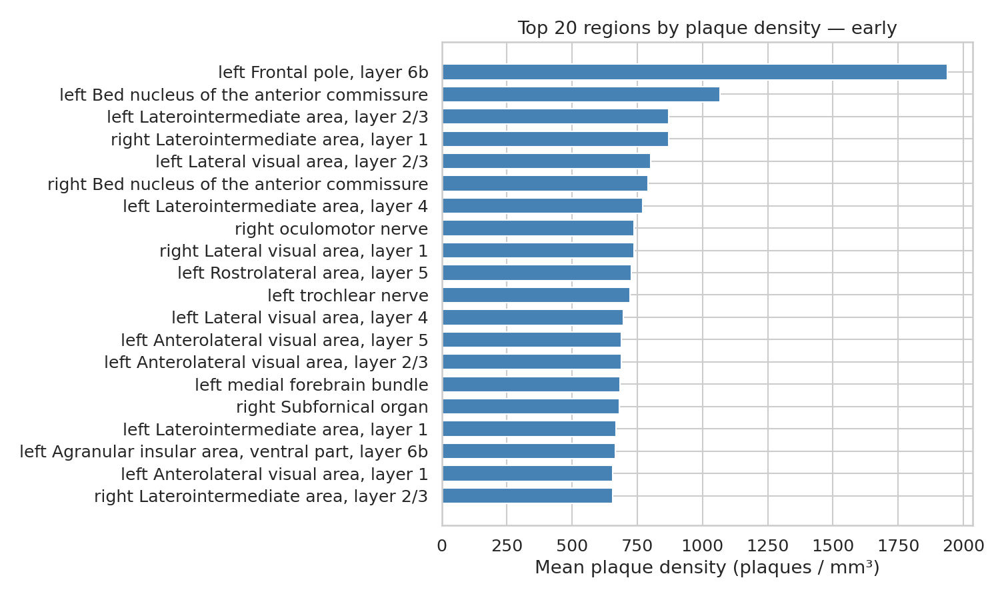

> **Top brain regions** ranked by mean Aβ plaque density — early cohort.

---

<!-- _class: light -->

## [Early] ROI Density Boxplot

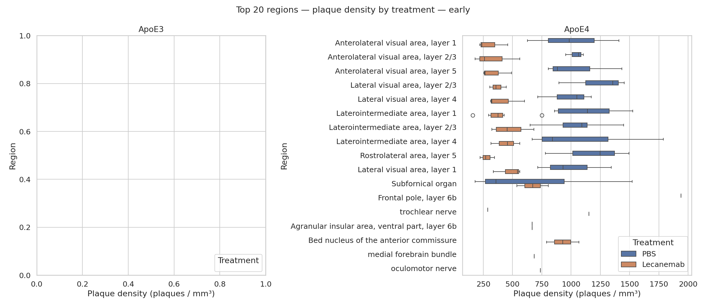

> Per-subject plaque density distributions across top regions — early cohort.

---

<!-- _class: light -->

## [Early] Multi-Metric Regional Heatmap

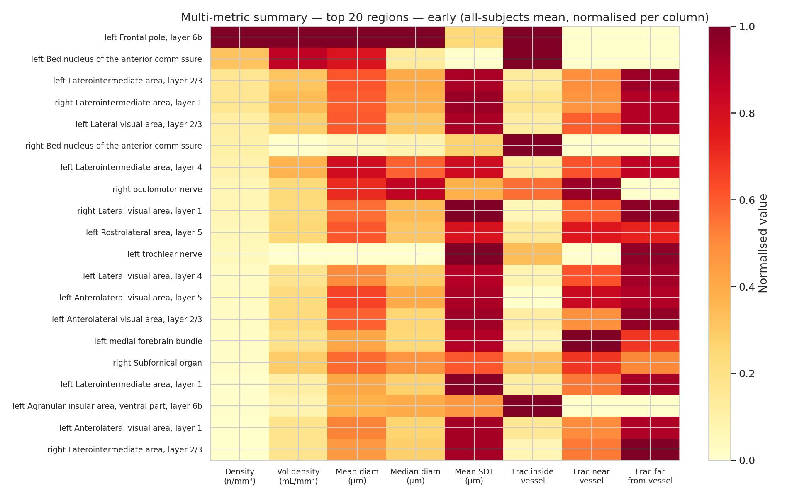

> Each metric is normalised [0, 1] per column — early cohort.

---

## [Early] ROI Proximity Fractions

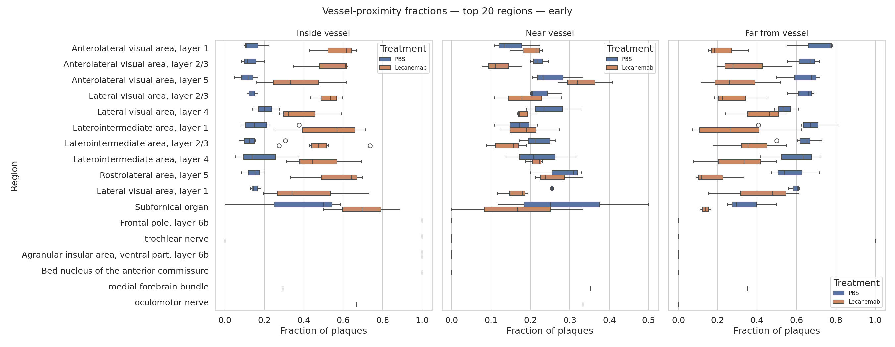

> Fraction of plaques near/inside vessels per region — early cohort.

---

<!-- _class: light -->

## [Early] ROI Treatment Fold-Change

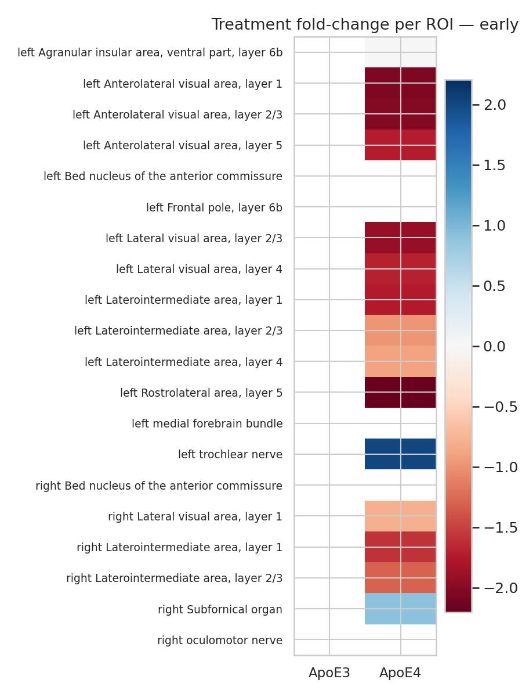

> Log₂ fold-change (Lecanemab / PBS) per ROI — early cohort.

---

## [Early] Atlas-Level Plaque Density — All Subjects

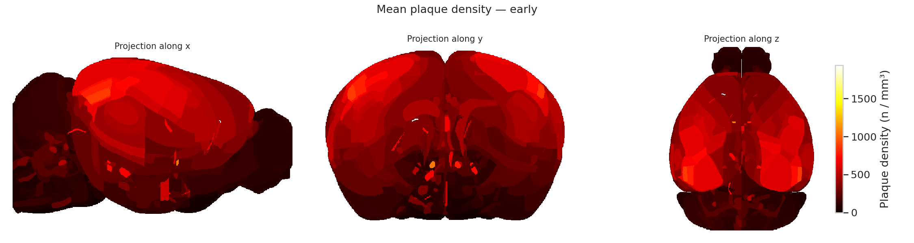

> Max-intensity projection of mean plaque density — early cohort.

---

## [Early] Atlas-Level Density by Group

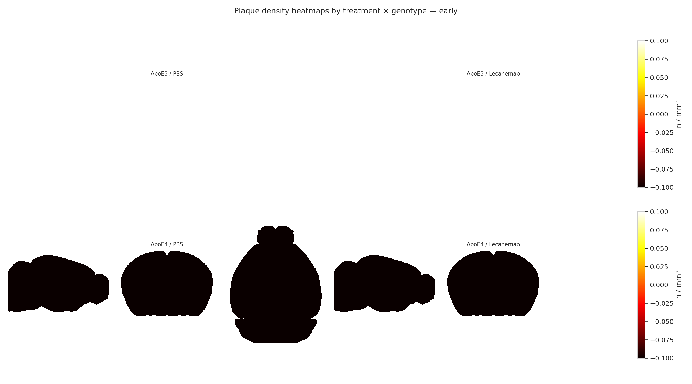

> Plaque density heatmaps by treatment × genotype — early cohort.

---

## [Early] Treatment Fold-Change Atlas


> Log₂ fold-change (Lecanemab / PBS) painted onto atlas volume — early cohort.

---

## [Early] Atlas Mean Plaque Diameter


> Mean equivalent plaque diameter painted onto atlas volume — early cohort.

---

## [Early] Atlas Fraction Inside Vessel


> Fraction of intravascular plaques painted onto atlas volume — early cohort.

---

<!-- _class: section-break lead -->

## [Early] Treatment Effect Analysis

---

<!-- _class: light -->

## [Early] Treatment Effects — Subject-Level Metrics

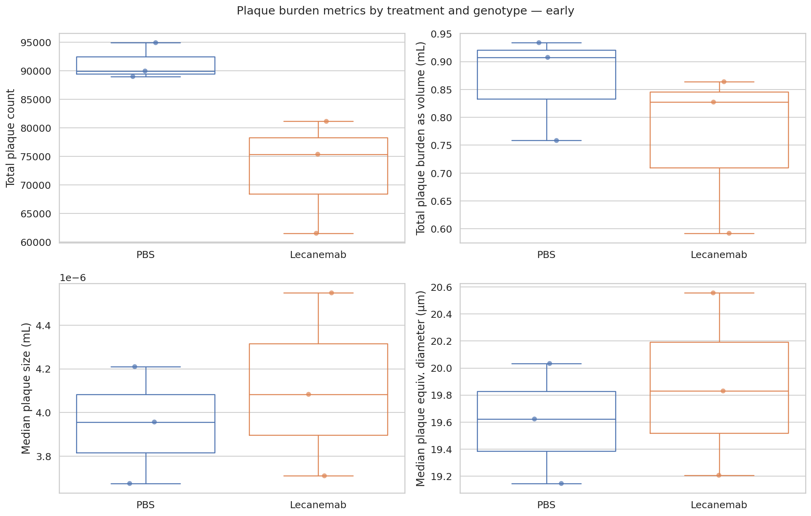

> Subject-level summary metrics by treatment × genotype — early cohort.

---

<!-- _class: light -->

## [Early] Violin — Plaque Size by Treatment & Genotype

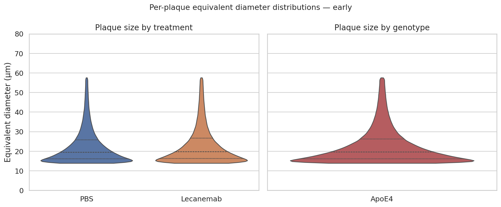

> Per-plaque size distributions by treatment × genotype — early cohort.

---

## [Early] Treatment × Genotype Interaction


> Mean ± SEM interaction plots for key metrics — early cohort.

---

## [Early] Plaque Count Stratified by Genotype

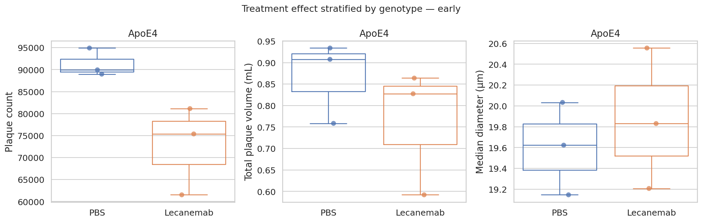

> Per-subject plaque counts stratified by genotype — early cohort.

---

<!-- _class: light -->

## [Early] ECDF — Plaque Size by Genotype

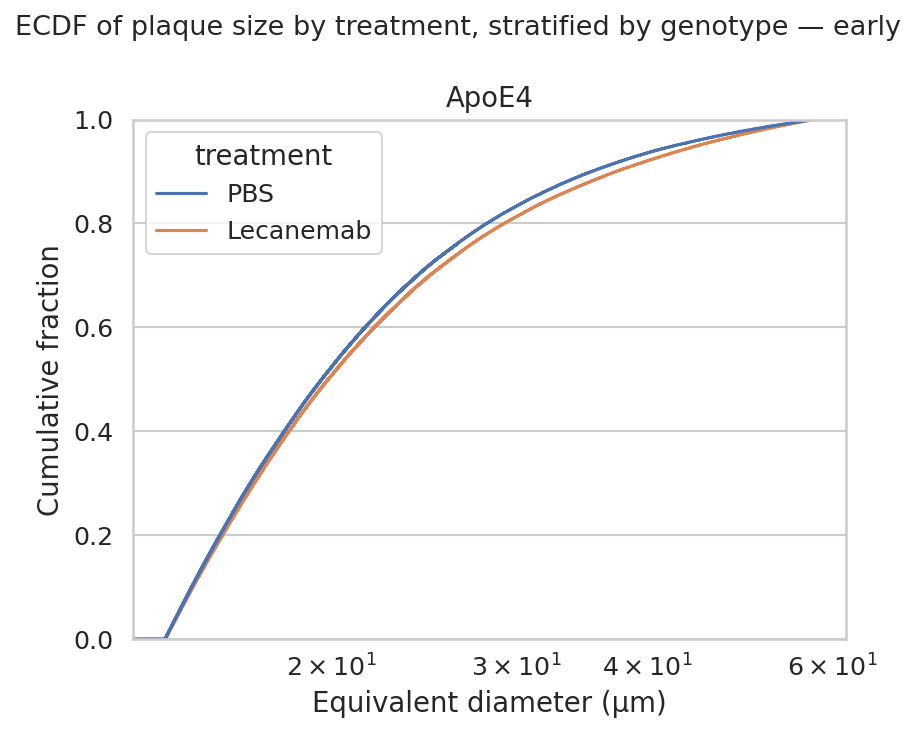

> Empirical CDF of per-plaque size by genotype — early cohort.

---

<!-- _class: light -->

## [Early] Plaque Size Distribution

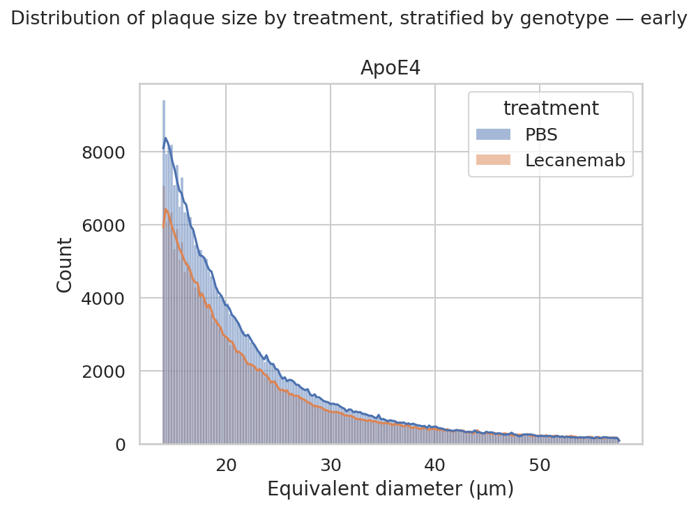

> Histogram of per-plaque size distributions by genotype — early cohort.

---

<!-- _class: section-break lead -->

## [Early] Vessel Spatial Analysis

---

## [Early] SDT ECDF — Distance to Vessel Wall

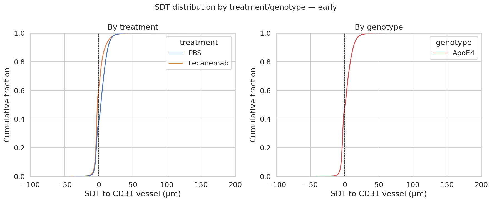

> ECDF of signed distance transform (SDT) to nearest vessel — early cohort.

---

<!-- _class: light -->

## [Early] Plaque–Vessel Proximity Fractions (Stacked)

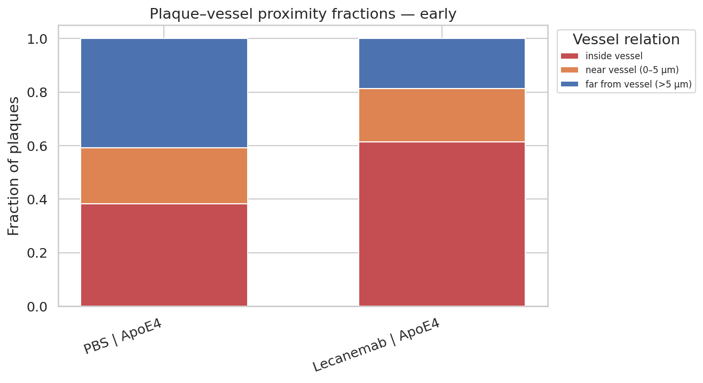

> Stacked bar charts of categorized plaque–vessel proximity — early cohort.

---

## [Early] Plaque–Vessel Proximity Fractions

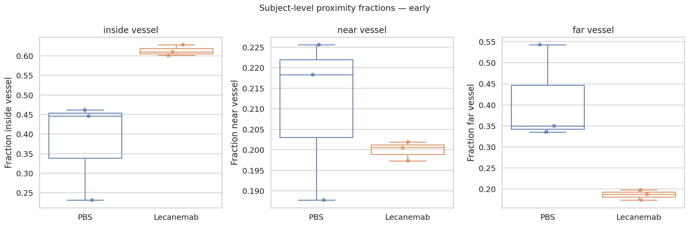

> Grouped bar charts of plaque–vessel proximity fractions — early cohort.

---

## [Early] Proximity × Treatment Interaction


> Interaction plots for proximity fractions by treatment × genotype — early cohort.

---

<!-- _class: light -->

## [Early] Vessel Calibre ECDF

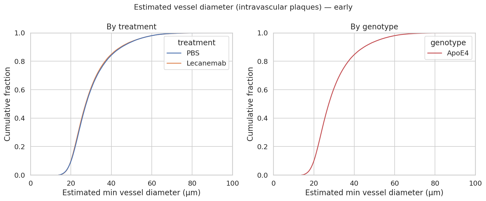

> ECDF of estimated vessel calibre for intravascular plaques — early cohort.

---

<!-- _class: light -->

## [Early] Vessel Calibre by Subject

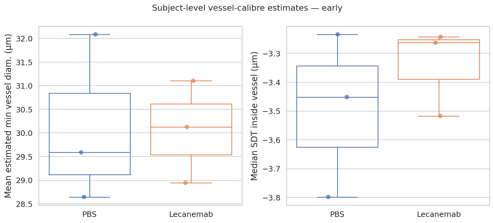

> Estimated vessel calibre per subject — early cohort.

---

## [Early] Vessel Diameter Bins

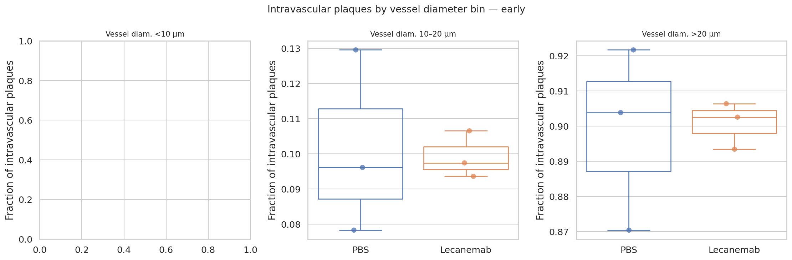

> Distribution of plaques across vessel diameter bins — early cohort.

---

## [Early] Spatial Vessel Proximity

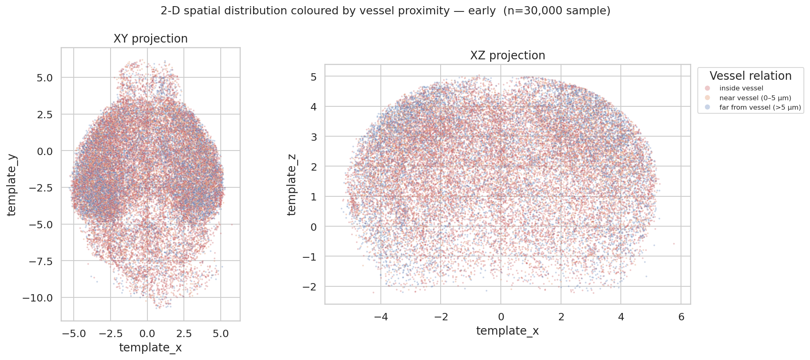

> Spatial mapping of plaque–vessel proximity across the brain — early cohort.

---

<!-- _class: section-break lead -->

# Results — Late Cohort
## (Lecanemab 12–15 mo, imaging at 15 mo)

---

<!-- _class: section-break lead -->

## [Late] Regional Analysis

---

## [Late] Regional Plaque Burden


> **Top brain regions** ranked by mean Aβ plaque density — late cohort.

---

<!-- _class: light -->

## [Late] ROI Density Boxplot


> Per-subject plaque density distributions across top regions — late cohort.

---

<!-- _class: light -->

## [Late] Multi-Metric Regional Heatmap


> Each metric is normalised [0, 1] per column — late cohort.

---

## [Late] ROI Proximity Fractions


> Fraction of plaques near/inside vessels per region — late cohort.

---

<!-- _class: light -->

## [Late] ROI Treatment Fold-Change


> Log₂ fold-change (Lecanemab / PBS) per ROI — late cohort.

---

## [Late] Atlas-Level Plaque Density — All Subjects


> Max-intensity projection of mean plaque density — late cohort.

---

## [Late] Atlas-Level Density by Group


> Plaque density heatmaps by treatment × genotype — late cohort.

---

## [Late] Treatment Fold-Change Atlas


> Log₂ fold-change (Lecanemab / PBS) painted onto atlas volume — late cohort.

---

## [Late] Atlas Mean Plaque Diameter


> Mean equivalent plaque diameter painted onto atlas volume — late cohort.

---

## [Late] Atlas Fraction Inside Vessel


> Fraction of intravascular plaques painted onto atlas volume — late cohort.

---

<!-- _class: section-break lead -->

## [Late] Treatment Effect Analysis

---

<!-- _class: light -->

## [Late] Treatment Effects — Subject-Level Metrics

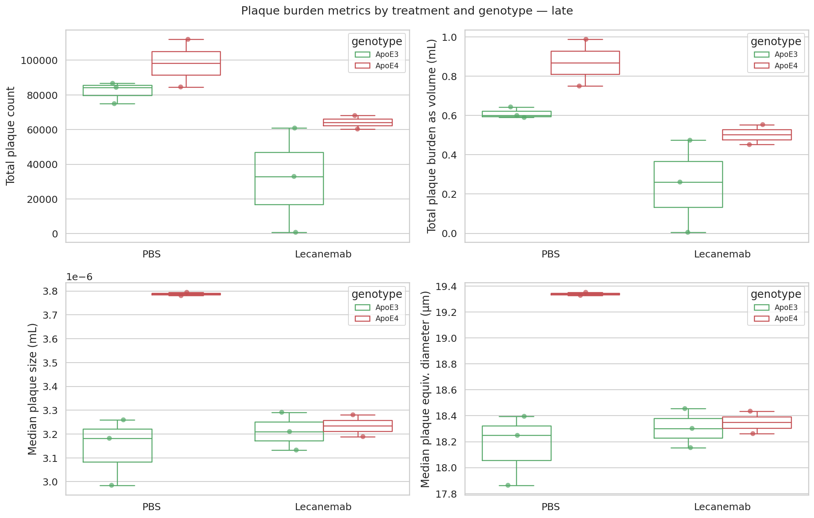

> Subject-level summary metrics by treatment × genotype — late cohort.

---

<!-- _class: light -->

## [Late] Violin — Plaque Size by Treatment & Genotype

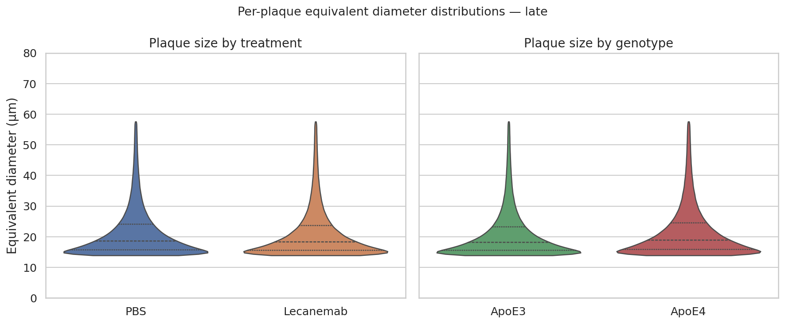

> Per-plaque size distributions by treatment × genotype — late cohort.

---

## [Late] Treatment × Genotype Interaction

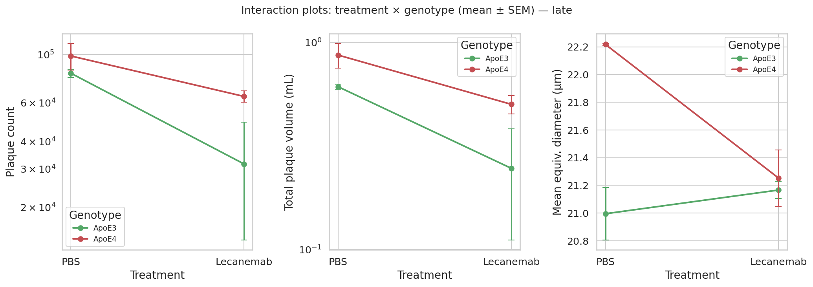

> Mean ± SEM interaction plots for key metrics — late cohort.

---

## [Late] Plaque Count Stratified by Genotype

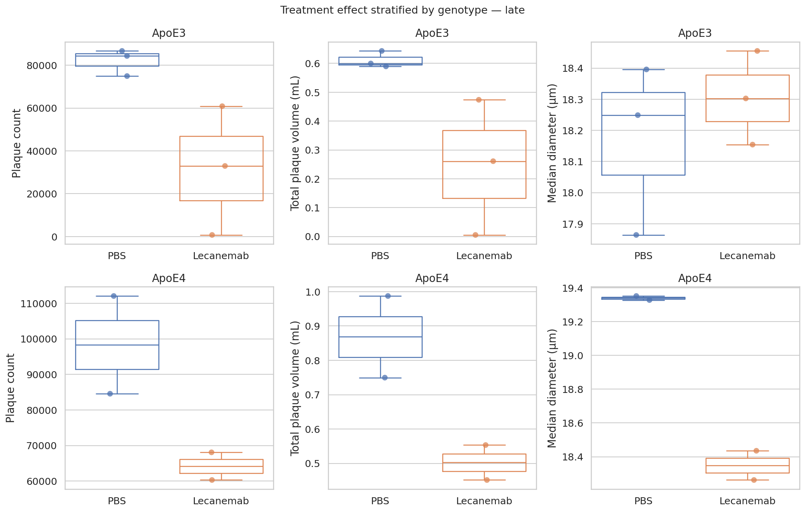

> Per-subject plaque counts stratified by genotype — late cohort.

---

<!-- _class: light -->

## [Late] ECDF — Plaque Size by Genotype

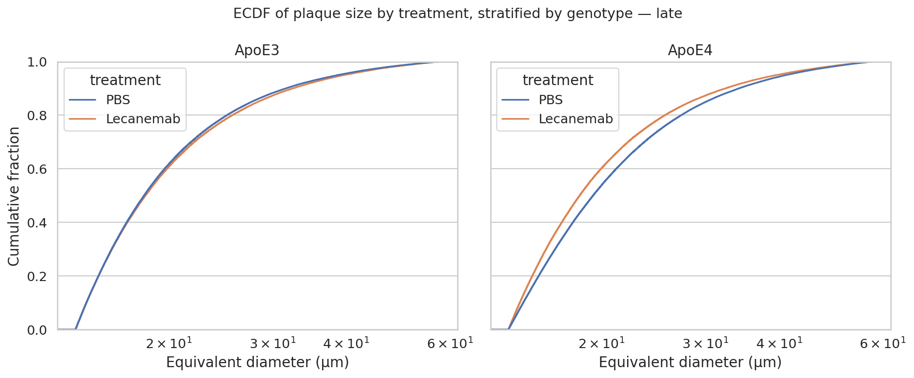

> Empirical CDF of per-plaque size by genotype — late cohort.

---

<!-- _class: light -->

## [Late] Plaque Size Distribution

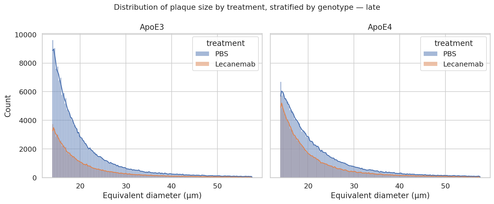

> Histogram of per-plaque size distributions by genotype — late cohort.

---

<!-- _class: section-break lead -->

## [Late] Vessel Spatial Analysis

---

## [Late] SDT ECDF — Distance to Vessel Wall

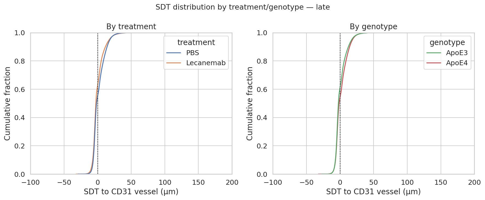

> ECDF of signed distance transform (SDT) to nearest vessel — late cohort.

---

<!-- _class: light -->

## [Late] Plaque–Vessel Proximity Fractions (Stacked)

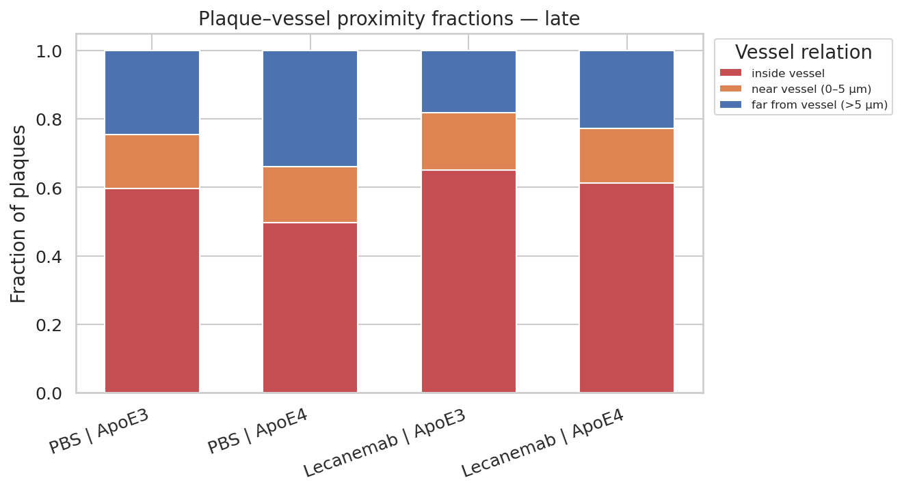

> Stacked bar charts of categorized plaque–vessel proximity — late cohort.

---

## [Late] Plaque–Vessel Proximity Fractions

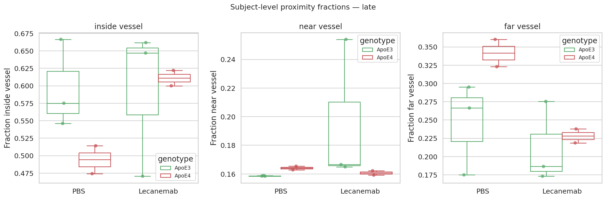

> Grouped bar charts of plaque–vessel proximity fractions — late cohort.

---

## [Late] Proximity × Treatment Interaction

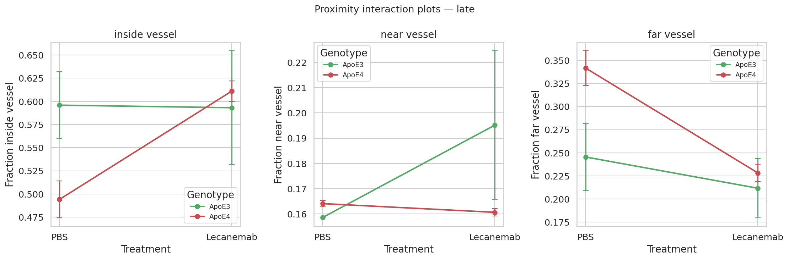

> Interaction plots for proximity fractions by treatment × genotype — late cohort.

---

<!-- _class: light -->

## [Late] Vessel Calibre ECDF

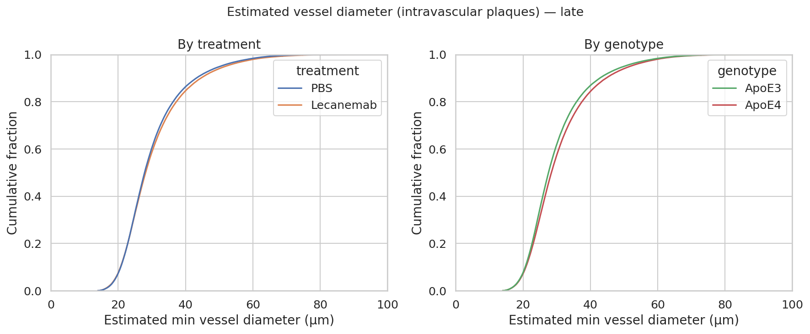

> ECDF of estimated vessel calibre for intravascular plaques — late cohort.

---

<!-- _class: light -->

## [Late] Vessel Calibre by Subject

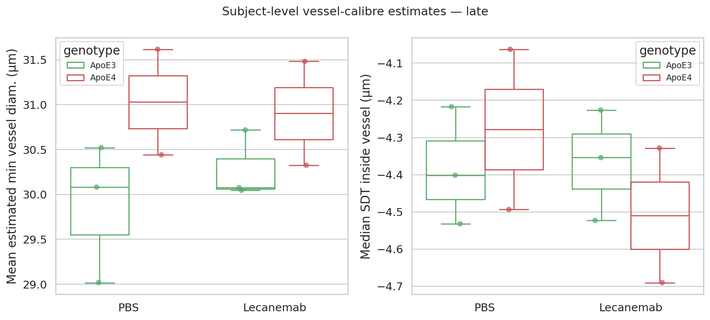

> Estimated vessel calibre per subject — late cohort.

---

## [Late] Vessel Diameter Bins

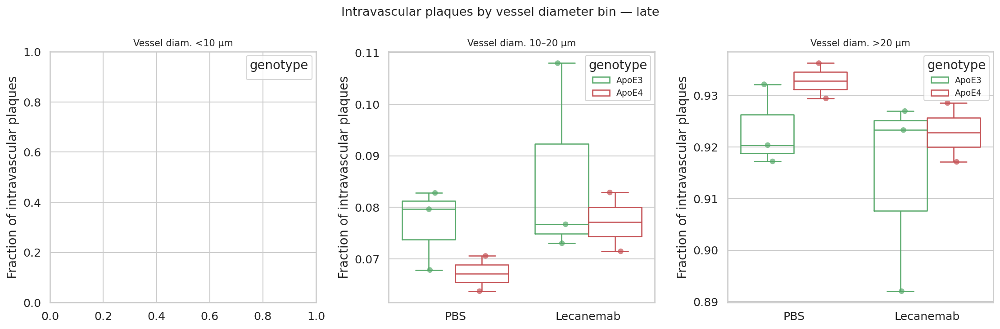

> Distribution of plaques across vessel diameter bins — late cohort.

---

## [Late] Spatial Vessel Proximity

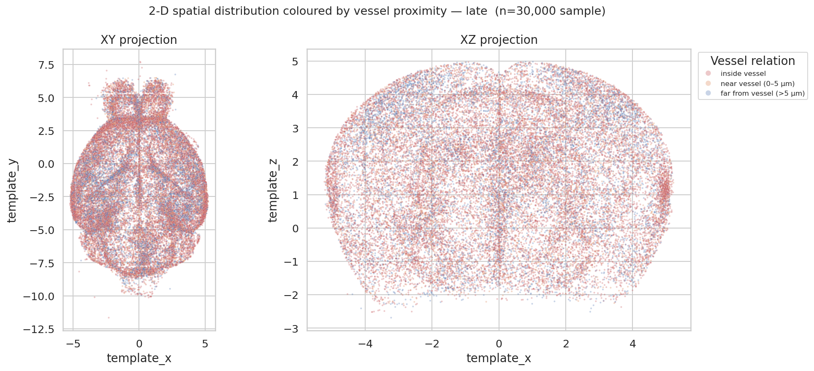

> Spatial mapping of plaque–vessel proximity across the brain — late cohort.

---

*Slides built with [Marp](https://marp.app) — source: `presentation.md`*
