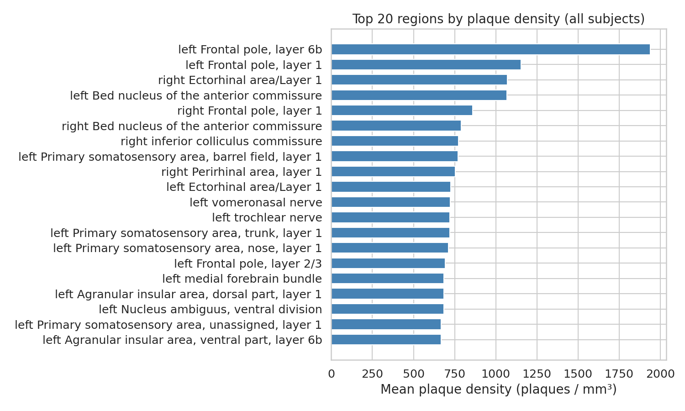
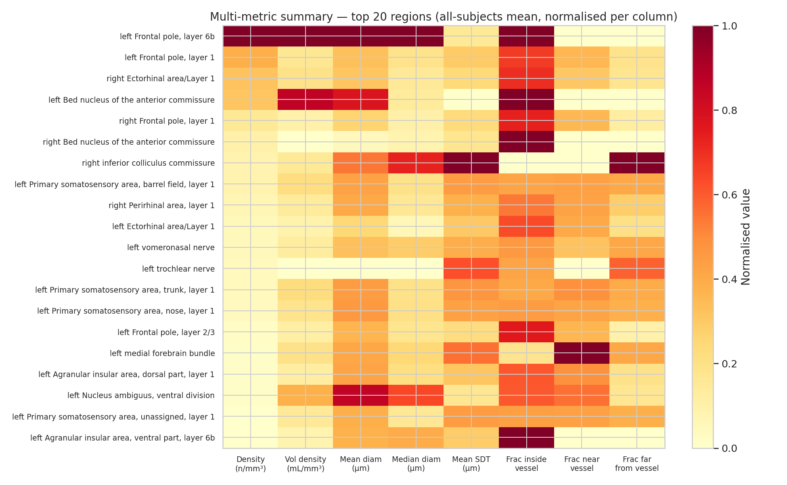
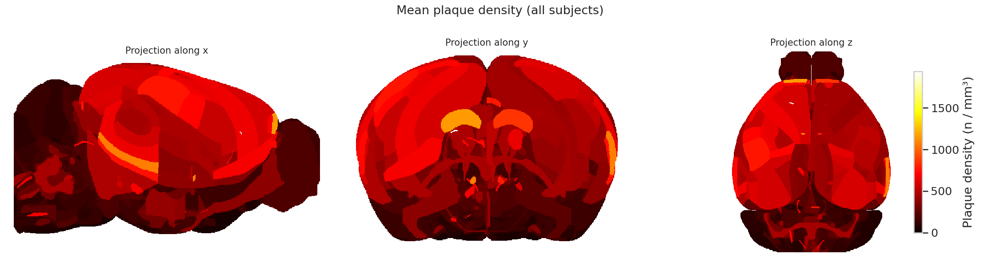
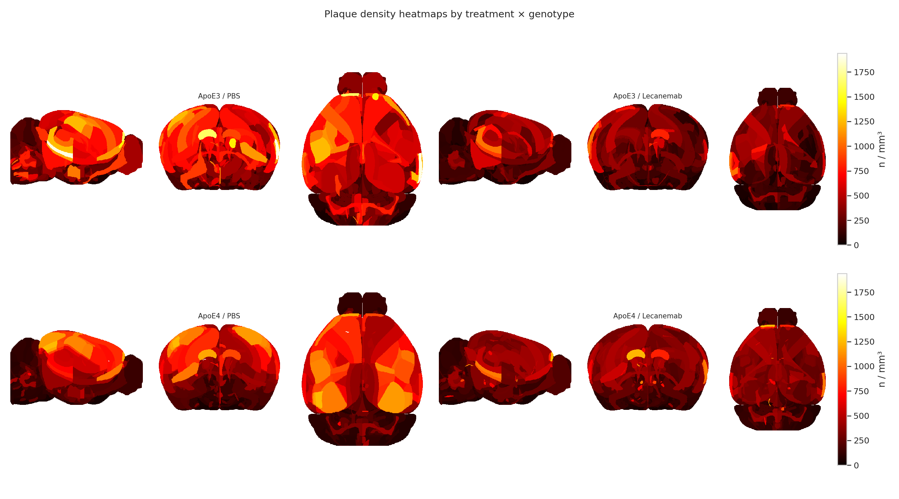
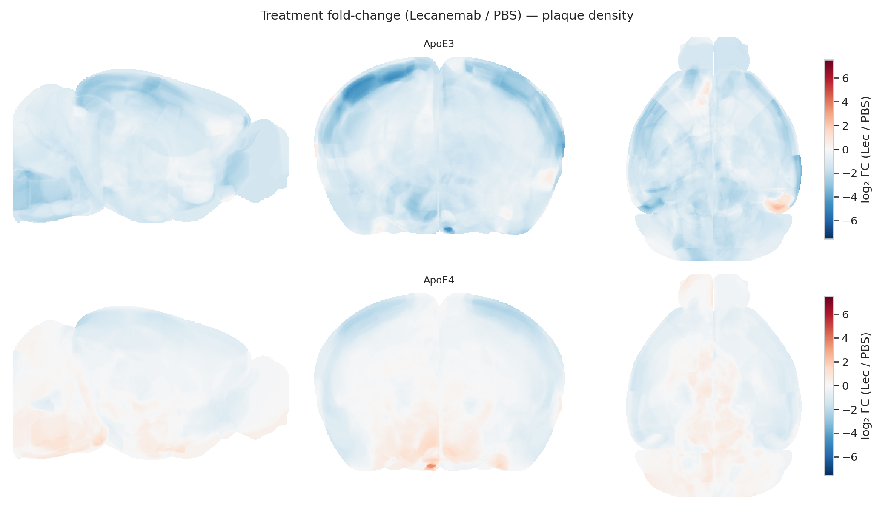
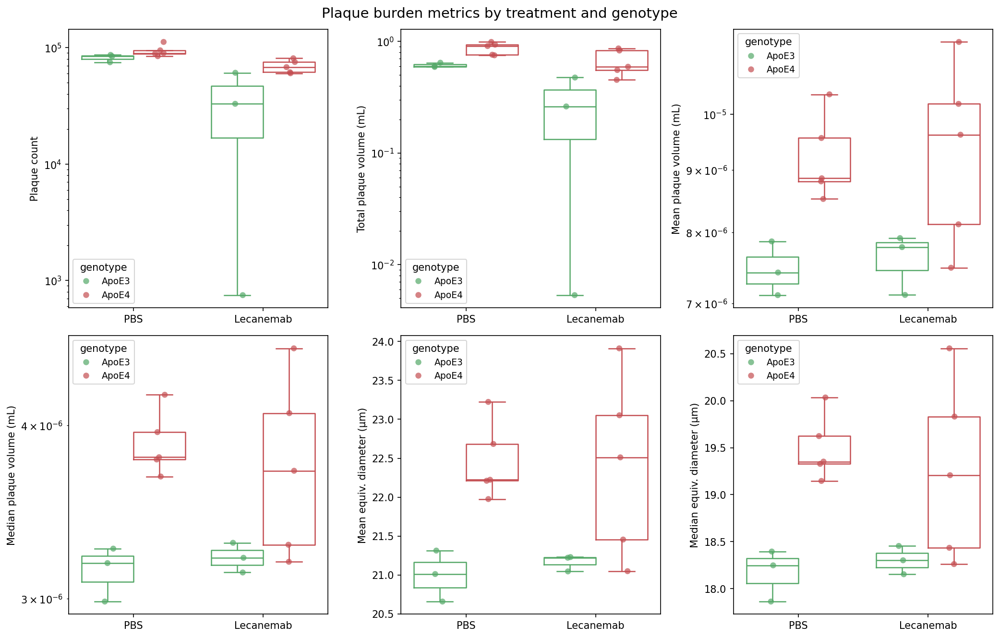
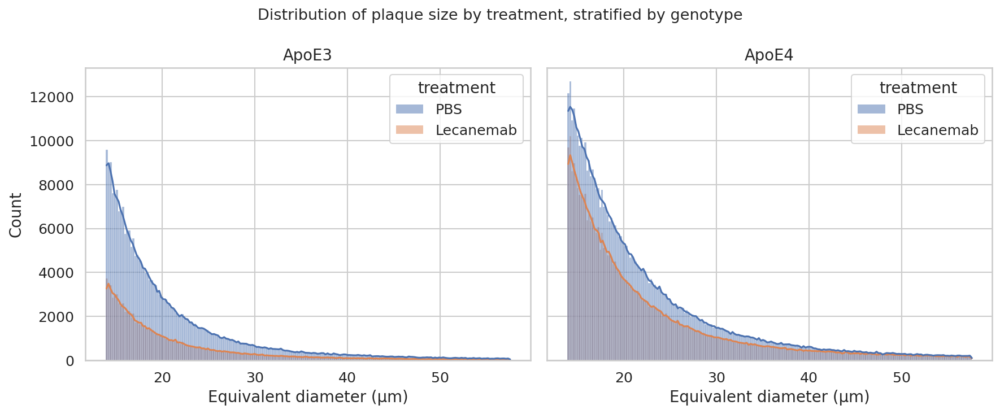
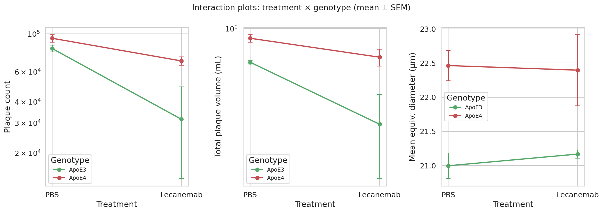
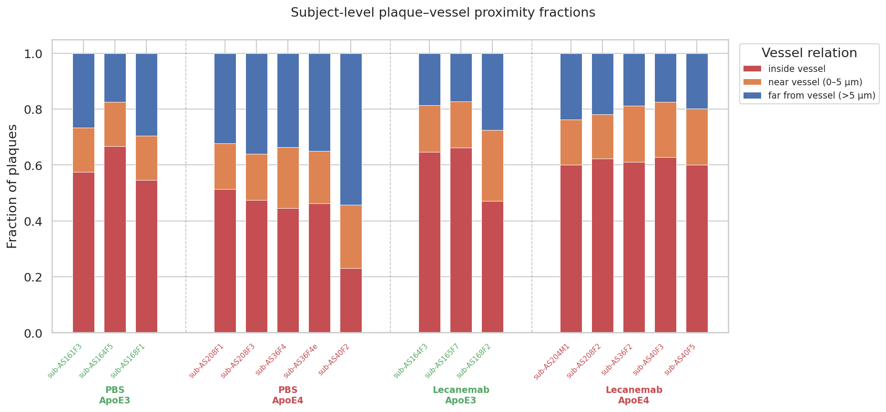

<!-- _class: lead invert -->

# Lecanemab Effects on Aβ Plaques
## A Whole-Brain Light-Sheet Microscopy Analysis

**Spatial distribution · Treatment efficacy · Vascular relationships**

*March 2026*

---

## Outline

1. **Background** — Alzheimer's disease, Lecanemab & ApoE
2. **Dataset** — Cohort, imaging modality, data structure
3. **Analysis Pipeline** — Overview of 5-notebook workflow
4. **Methods** — Regional, treatment & vascular analyses
5. **Results** — Regional burden, treatment effects, vessel proximity

---

<!-- _class: section-break lead -->

# Background

---

<!-- _class: light -->

## Alzheimer's Disease & Aβ Plaques

<div class="columns">
<div>

**Amyloid-β (Aβ) plaques** are a hallmark pathological feature of Alzheimer's disease, accumulating in the brain parenchyma and around cerebral vasculature.

**Key questions:**
- Which brain regions accumulate the most plaques?
- Does **Lecanemab** (anti-Aβ immunotherapy) reduce plaque burden?
- Does **ApoE genotype** (ApoE3 vs ApoE4) modulate treatment response?
- What is the spatial relationship between plaques and **blood vessels**?

</div>
<div>

**Experimental model:**
- Humanized mouse model of Alzheimer's disease
- hAppNL-F-hMAPT-APOE4 and hAppNL-F-hMAPT-APOE3

**Treatment arms:**
| Group | Description |
|---|---|
| PBS | Vehicle control |
| Lecanemab | Anti-Aβ immunotherapy |

**Readout:** Instance-level Aβ plaque segmentation via whole-brain 3-D light-sheet microscopy

</div>
</div>

---

<!-- _class: light -->

## Why Light-Sheet Microscopy?

<div class="columns">
<div>

**Whole-brain 3-D imaging** at near-cellular resolution enables:

- **Unbiased** spatial mapping of every Aβ plaque
- **Registration** to a common template (CCFv3 / ABAv3)
- Quantification of **vessel proximity** via CD31 vascular segmentation

**Voxel resolution:** 1.6 × 1.6 × 2.75 µm

</div>
<div>

**Signed Distance Transform (SDT):**

A plaque's `sdt_CD31` value encodes its distance to the nearest vessel wall:

| SDT value | Location |
|---|---|
| `< 0` | **Inside** vessel lumen |
| `0 – 5 µm` | **Near** vessel surface |
| `> 5 µm` | **Far** from vasculature |

> Vessel calibre estimated as:  
> `diam_vessel ≈ diam_plaque + 2|SDT|`

</div>
</div>

---

<!-- _class: section-break lead -->

# Dataset

---

<!-- _class: light -->

## Dataset Overview

<div class="columns">
<div>

**`data.parquet`** — ~1.15 million instance-level plaque records

**Plaque metrics:**
- `nvoxels` — voxel count (min: 200)
- `plaque_vol_ml` — volume (µL)
- `equiv_diam_um` — equivalent spherical diameter

**Spatial coordinates:**
- `pos_x / y / z` — raw image space
- `template_x / y / z` — CCFv3 template space

</div>
<div>

**Anatomical labelling:**
- `label` — Allen Brain Atlas v3 region name
- `index` — ABA region index (2,655 regions)

**Vascular proximity:**
- `sdt_CD31` — signed distance to CD31⁺ vessel (mm)

**Demographics:**
- `subject` — individual animal ID
- `genotype` — ApoE3 / ApoE4
- `sex` — M / F
- `treatment` — PBS / Lecanemab

</div>
</div>

---

<!-- _class: section-break lead -->

# Analysis Pipeline

---

<!-- _class: light -->

## Five-Notebook Workflow

```
import_data.ipynb
   │  Load data.parquet · Inspect schema · Summary statistics
   ▼
regional_dataframe.ipynb
   │  Classify plaque–vessel proximity
   │  Aggregate to per-subject × per-region ROI summaries
   │  Compute regional plaque density  →  roi_data.parquet
   ├──▶ regional_analysis.ipynb
   │       Atlas heatmaps · ROI rankings · Fold-change maps
   ├──▶ treatment_effect_analysis.ipynb
   │       Two-way ANOVA · Post-hoc comparisons · ECDFs
   └──▶ vessel_spatial_analysis.ipynb
           SDT distributions · Proximity fractions · Vessel calibre
```

> **Reproducibility:** All notebooks executed via `pixi run run_notebooks`  
> using the pinned Pixi environment (`pixi.lock`)

---

<!-- _class: section-break lead -->

# Methods

---

<!-- _class: light -->

## Methods: Data Preprocessing

**Step 1 — Plaque size filtering**
- Minimum size threshold: **200 voxels** (~1,408 µm³ at 1.6 × 1.6 × 2.75 µm voxel size)
- Ensures only genuine plaques; no upper size limit applied

**Step 2 — Plaque–vessel proximity classification**

| Category | Criterion | Count |
|---|---|---|
| Inside vessel | SDT < 0 | **622,701** |
| Near vessel | 0 ≤ SDT < 5 µm | **208,896** |
| Far from vessel | SDT ≥ 5 µm | **325,894** |

**Step 3 — Regional aggregation**
- Each plaque mapped to an ABA v3 atlas region
- Per-subject, per-region counts → **plaque density** (plaques/mm³)
- Proximity fractions computed per region per subject

---

<!-- _class: light -->

## Methods: Regional Analysis

**Objective:** Identify brain regions with the highest Aβ burden and characterise spatial patterns.

**Approaches:**
- **ROI ranking** — Top regions by mean plaque density across subjects
- **Multi-metric heatmap** — Normalised [0, 1] comparison of density, diameter, and vessel-fraction across top ROIs
- **Treatment fold-change** — Log₂(Lecanemab / PBS) per ROI
- **Atlas heatmaps** — Max-intensity projections of density and fold-change painted onto the 3-D Allen Brain Atlas volume (3 orthogonal views)

**Statistical outputs:**
- Subject-mean summaries per ROI
- Proximity-fraction comparisons by treatment

---

<!-- _class: light -->

## Methods: Treatment Effect Analysis

**Objective:** Quantify the effect of Lecanemab treatment on Aβ plaque burden and size, modulated by ApoE genotype.

**Subject-level metrics:**
- Total plaque count, mean plaque volume, mean equivalent diameter
- Fraction of plaques inside / near / far from vessels

**Statistical framework:**

| Test | Purpose |
|---|---|
| Two-way ANOVA | Treatment × Genotype interaction |
| Tukey HSD post-hoc | Pairwise group comparisons |
| ECDF plots | Distribution-level comparisons |

**Grouping factors:** `treatment` (PBS / Lecanemab) × `genotype` (ApoE3 / ApoE4)

---

<!-- _class: light -->

## Methods: Vessel Spatial Analysis

**Objective:** Characterise how Aβ plaques distribute relative to the cerebral vasculature and whether this relationship is altered by treatment or genotype.

<div class="columns">
<div>

**SDT analysis:**
- ECDF of SDT values by treatment & genotype
- Two-way ANOVA on mean SDT

**Proximity fractions:**
- Stacked bar plots per group
- ANOVA on fractions

</div>
<div>

**Spatial scatter plots:**
- Plaques plotted in CCFv3 template space (3 views)
- Coloured by proximity category

**Vessel calibre (intravascular plaques):**
- Minimum vessel diameter: `diam_plaque + 2 × |SDT|`
- ECDF and subject-level summaries

</div>
</div>

---

<!-- _class: section-break lead -->

# Results

---

## Regional Plaque Burden



> **Top brain regions** ranked by mean Aβ plaque density across all subjects.
> Cortical and limbic areas show the highest accumulation.

---

<!-- _class: light -->

## Multi-Metric Regional Heatmap



> Each metric is normalised [0, 1] per column. The heatmap reveals co-varying regions for plaque density, mean diameter, and intravascular fraction.

---

## Atlas-Level Plaque Density — All Subjects



> Max-intensity projection of mean plaque density across all subjects painted onto the Allen Brain Atlas v3 volume (coronal · horizontal · sagittal).

---

## Atlas-Level Density by Group



> Plaque density heatmaps stratified by **treatment × genotype** groups reveal distinct regional patterns between PBS and Lecanemab cohorts.

---

## Treatment Fold-Change Atlas



> **Log₂ fold-change** (Lecanemab / PBS) mapped onto the Allen Brain Atlas volume. **Warm colours** = regions where Lecanemab reduced plaque burden; **cool colours** = increased burden.

---

<!-- _class: light -->

## Treatment Effects — Subject-Level Metrics



> Subject-level summary metrics stratified by **treatment × genotype**. Lecanemab significantly reduces overall Aβ plaque burden, with an ApoE genotype-dependent effect.

---

<!-- _class: light -->

## Plaque Size Distribution



> Histogram of per-plaque size distributions reveals that Lecanemab in ApoE3 mice more effectively clears smaller plaques than in ApoE4 mice. 

---

## Treatment × Genotype Interaction



> Interaction plots highlight that **ApoE3** mice show a greater absolute reduction in plaque burden following Lecanemab treatment compared to ApoE4 mice. 

---

<!-- _class: light -->

## Plaque–Vessel Proximity Fractions



> Stacked bar charts of categorized plaque-vessel proximity


---

*Slides built with [Marp](https://marp.app) — source: `presentation.md`*
